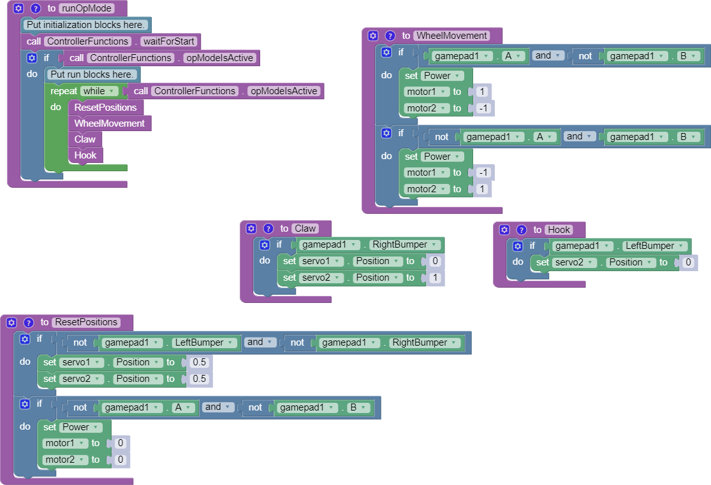
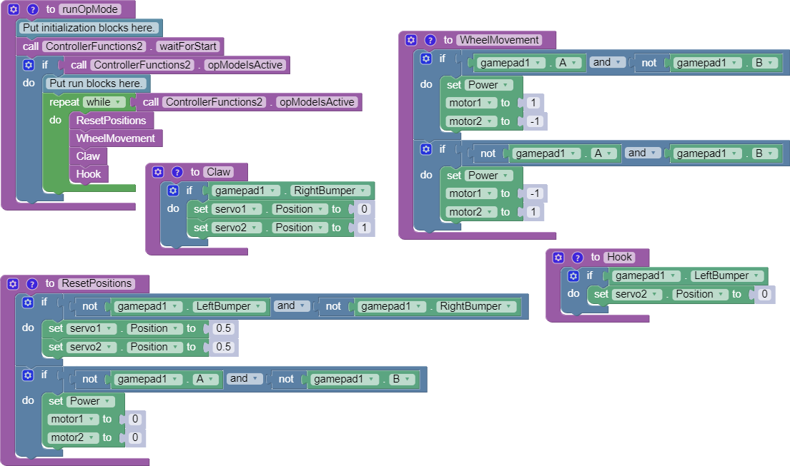
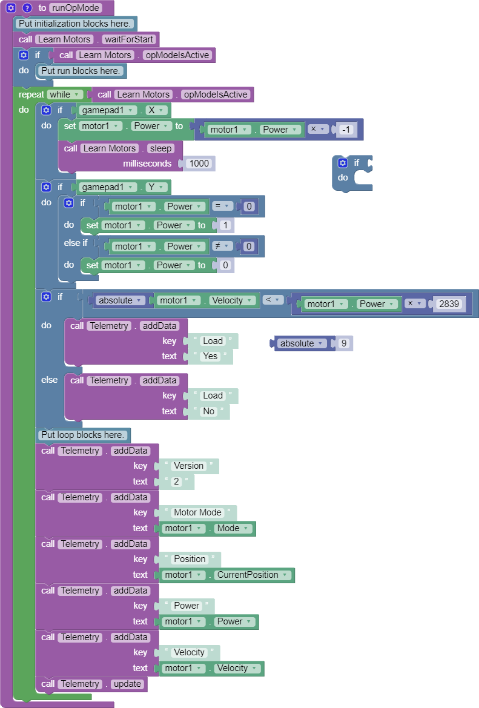
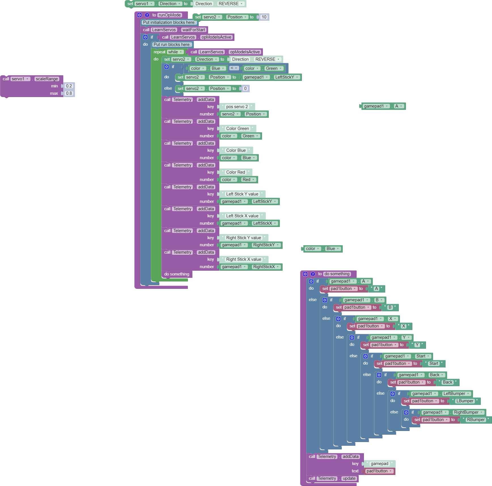
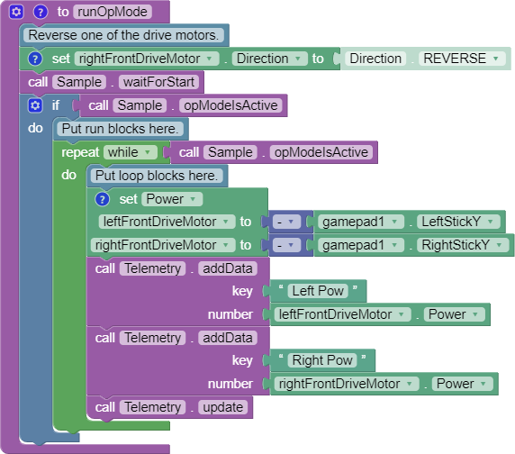

## ControllerFunctions



```java
package org.firstinspires.ftc.teamcode;

import com.qualcomm.robotcore.eventloop.opmode.LinearOpMode;
import com.qualcomm.robotcore.eventloop.opmode.TeleOp;
import com.qualcomm.robotcore.hardware.DcMotor;
import com.qualcomm.robotcore.hardware.Servo;

@TeleOp(name = "ControllerFunctions (Blocks to Java)", group = "")
public class ControllerFunctions extends LinearOpMode {

  private DcMotor motor1;
  private DcMotor motor2;
  private Servo servo1;
  private Servo servo2;

  /**
   * This function is executed when this Op Mode is selected from the Driver Station.
   */
  @Override
  public void runOpMode() {
    motor1 = hardwareMap.dcMotor.get("motor1");
    motor2 = hardwareMap.dcMotor.get("motor2");
    servo1 = hardwareMap.servo.get("servo1");
    servo2 = hardwareMap.servo.get("servo2");

    // Put initialization blocks here.
    waitForStart();
    if (opModeIsActive()) {
      // Put run blocks here.
      while (opModeIsActive()) {
        ResetPositions();
        WheelMovement();
        Claw();
        Hook();
      }
    }
  }

  /**
   * Describe this function...
   */
  private void WheelMovement() {
    if (gamepad1.a && !gamepad1.b) {
      motor1.setPower(1);
      motor2.setPower(-1);
    }
    if (!gamepad1.a && gamepad1.b) {
      motor1.setPower(-1);
      motor2.setPower(1);
    }
  }

  /**
   * Describe this function...
   */
  private void Claw() {
    if (gamepad1.right_bumper) {
      servo1.setPosition(0);
      servo2.setPosition(1);
    }
  }

  /**
   * Describe this function...
   */
  private void Hook() {
    if (gamepad1.left_bumper) {
      servo2.setPosition(0);
    }
  }

  /**
   * Describe this function...
   */
  private void ResetPositions() {
    if (!gamepad1.left_bumper && !gamepad1.right_bumper) {
      servo1.setPosition(0.5);
      servo2.setPosition(0.5);
    }
    if (!gamepad1.a && !gamepad1.b) {
      motor1.setPower(0);
      motor2.setPower(0);
    }
  }
}

```

----

## ControllerFunctions2



```java
package org.firstinspires.ftc.teamcode;

import com.qualcomm.robotcore.eventloop.opmode.LinearOpMode;
import com.qualcomm.robotcore.eventloop.opmode.TeleOp;
import com.qualcomm.robotcore.hardware.Servo;

@TeleOp(name = "ControllerFunctions2 (Blocks to Java)", group = "")
public class ControllerFunctions2 extends LinearOpMode {

  private Servo servo1;
  private Servo servo2;

  /**
   * This function is executed when this Op Mode is selected from the Driver Station.
   */
  @Override
  public void runOpMode() {
    servo1 = hardwareMap.servo.get("servo1");
    servo2 = hardwareMap.servo.get("servo2");

    // Put initialization blocks here.
    waitForStart();
    if (opModeIsActive()) {
      // Put run blocks here.
      while (opModeIsActive()) {
        ResetServoPosition();
        Claw();
      }
    }
  }

  /**
   * Describe this function...
   */
  private void Claw() {
    if (gamepad1.right_bumper) {
      servo1.setPosition(0);
      servo2.setPosition(1);
    }
  }

  /**
   * Describe this function...
   */
  private void Hook() {
    if (gamepad1.left_bumper) {
      servo2.setPosition(1);
    }
  }

  /**
   * Describe this function...
   */
  private void ResetServoPosition() {
    if (!(gamepad1.left_bumper && gamepad1.right_bumper)) {
      servo1.setPosition(0.5);
      servo2.setPosition(0.5);
    }
  }
}
```

----

## ControllerFunctions22

```java
package org.firstinspires.ftc.teamcode;

import com.qualcomm.robotcore.eventloop.opmode.LinearOpMode;
import com.qualcomm.robotcore.eventloop.opmode.TeleOp;
import com.qualcomm.robotcore.hardware.Servo;

@TeleOp(name = "ControllerFunctions22 (Blocks to Java)", group = "")
public class ControllerFunctions22 extends LinearOpMode {

  private Servo servo1;
  private Servo servo2;

  /**
   * This function is executed when this Op Mode is selected from the Driver Station.
   */
  @Override
  public void runOpMode() {
    servo1 = hardwareMap.servo.get("servo1");
    servo2 = hardwareMap.servo.get("servo2");

    // Put initialization blocks here.
    waitForStart();
    if (opModeIsActive()) {
      // Put run blocks here.
      while (opModeIsActive()) {
        ResetServoPosition();
        Claw();
      }
    }
  }

  /**
   * Describe this function...
   */
  private void Claw() {
    if (gamepad1.right_bumper) {
      servo1.setPosition(0);
      servo2.setPosition(1);
    }
  }

  /**
   * Describe this function...
   */
  private void Hook() {
    if (gamepad1.left_bumper) {
      servo2.setPosition(1);
    }
  }

  /**
   * Describe this function...
   */
  private void ResetServoPosition() {
    if (!(gamepad1.left_bumper && gamepad1.right_bumper)) {
      servo1.setPosition(0.5);
      servo2.setPosition(0.5);
    }
  }
}
```

----

## LearnMotors



```java
package org.firstinspires.ftc.teamcode;

import com.qualcomm.robotcore.eventloop.opmode.LinearOpMode;
import com.qualcomm.robotcore.eventloop.opmode.TeleOp;
import com.qualcomm.robotcore.hardware.DcMotor;
import com.qualcomm.robotcore.hardware.DcMotorEx;

@TeleOp(name = "LearnMotors (Blocks to Java)", group = "")
public class LearnMotors extends LinearOpMode {

  private DcMotor motor1;

  /**
   * This function is executed when this Op Mode is selected from the Driver Station.
   */
  @Override
  public void runOpMode() {
    motor1 = hardwareMap.dcMotor.get("motor1");

    // Put initialization blocks here.
    waitForStart();
    if (opModeIsActive()) {
      // Put run blocks here.
    }
    while (opModeIsActive()) {
      if (gamepad1.x) {
        motor1.setPower(motor1.getPower() * -1);
        sleep(1000);
      }
      if (gamepad1.y) {
        if (motor1.getPower() == 0) {
          motor1.setPower(1);
        } else if (motor1.getPower() != 0) {
          motor1.setPower(0);
        }
      }
      if (Math.abs(((DcMotorEx) motor1).getVelocity()) < motor1.getPower() * 2839) {
        telemetry.addData("Load", "Yes");
      } else {
        telemetry.addData("Load", "No");
      }
      // Put loop blocks here.
      telemetry.addData("Version", "2");
      telemetry.addData("Motor Mode", motor1.getMode());
      telemetry.addData("Position", motor1.getCurrentPosition());
      telemetry.addData("Power", motor1.getPower());
      telemetry.addData("Velocity", ((DcMotorEx) motor1).getVelocity());
      telemetry.update();
    }
  }
}
```

----

## AtHomeOpModeJava

```java
package org.firstinspires.ftc.teamcode;

import com.qualcomm.robotcore.eventloop.opmode.LinearOpMode;
import com.qualcomm.robotcore.eventloop.opmode.TeleOp;
import com.qualcomm.robotcore.hardware.DcMotor;

@TeleOp(name = "AtHomeOpMode (Blocks to Java)", group = "")
public class AtHomeOpMode extends LinearOpMode {

  private DcMotor motor1;
  private DcMotor motor2;

  /**
   * This function is executed when this Op Mode is selected from the Driver Station.
   */
  @Override
  public void runOpMode() {
    motor1 = hardwareMap.dcMotor.get("motor1");
    motor2 = hardwareMap.dcMotor.get("motor2");

    // Put initialization blocks here.
    waitForStart();
    while (opModeIsActive()) {
      // Put loop blocks here.
      telemetry.update();
      motor1.setPower(1);
      motor2.setPower(1);
    }
  }
}
```

----

## LearnServos




```java
package org.firstinspires.ftc.teamcode;

import com.qualcomm.robotcore.eventloop.opmode.LinearOpMode;
import com.qualcomm.robotcore.eventloop.opmode.TeleOp;
import com.qualcomm.robotcore.hardware.ColorSensor;
import com.qualcomm.robotcore.hardware.Servo;

@TeleOp(name = "LearnServos (Blocks to Java)", group = "")
public class LearnServos extends LinearOpMode {

  private Servo servo1;
  private Servo servo2;
  private ColorSensor color;

  /**
   * This function is executed when this Op Mode is selected from the Driver Station.
   */
  @Override
  public void runOpMode() {
    servo1 = hardwareMap.servo.get("servo1");
    servo2 = hardwareMap.servo.get("servo2");
    color = hardwareMap.colorSensor.get("color");

    // Put initialization blocks here.
    waitForStart();
    if (opModeIsActive()) {
      // Put run blocks here.
      while (opModeIsActive()) {
        servo2.setDirection(Servo.Direction.REVERSE);
        if (color.blue() < color.green()) {
          servo2.setPosition(gamepad1.left_stick_y);
        } else {
          servo2.setPosition(0);
        }
        telemetry.addData("pos servo 2", servo2.getPosition());
        telemetry.addData("Color Green", color.green());
        telemetry.addData("Color Blue", color.blue());
        telemetry.addData("Color Red", color.red());
        telemetry.addData("Left Stick Y value", gamepad1.left_stick_y);
        telemetry.addData("Left Stick X value", gamepad1.left_stick_x);
        telemetry.addData("Right Stick Y value", gamepad1.right_stick_y);
        telemetry.addData("Right Stick X value", gamepad1.right_stick_x);
        do_something();
      }
    }
  }

  /**
   * Describe this function...
   */
  private void do_something() {
    String pad1button;

    if (gamepad1.a) {
      pad1button = "A";
    } else {
      if (gamepad1.b) {
        pad1button = "B";
      } else {
        if (gamepad1.x) {
          pad1button = "X";
        } else {
          if (gamepad1.y) {
            pad1button = "Y";
          } else {
            if (gamepad1.start) {
              pad1button = "Start";
            } else {
              if (gamepad1.back) {
                pad1button = "Back";
              } else {
                if (gamepad1.left_bumper) {
                  pad1button = "LBumper";
                } else {
                  if (gamepad1.right_bumper) {
                    pad1button = "RBumper";
                  }
                }
              }
            }
          }
        }
      }
    }
    telemetry.addData("gamepad", pad1button);
    telemetry.update();
  }
}
```

----

## Sample.png


